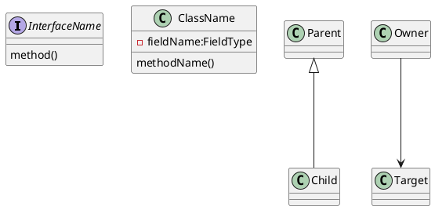

# ArchLens

A monorepo with a **Python CLI** that generates UML class diagrams from compiled binaries. Pass a `.jar` (Java) or `.dll` (C#) file and get PlantUML or yUML output.

| Language | Input  | Status      |
| -------- | ------ | ----------- |
| Java     | `.jar` | Implemented |
| C#       | `.dll` | Coming soon |

---

## Repository Structure

```text
.
├── pyproject.toml          # Python project root (uv + setuptools)
├── archlens/               # Python orchestrator package
│   ├── cli.py              # Entry point: decompile command
│   ├── router.py           # Routes .jar → Java adapter, .dll → C# adapter
│   ├── config.py           # DecompileConfig dataclass
│   ├── build.py            # Entry points: build-java, build-csharp, build-all
│   └── adapters/
│       ├── java_adapter.py     # Invokes the Java fat JAR via subprocess
│       └── csharp_adapter.py   # Stub — raises NotImplementedError
├── tests/                  # Python test suite (pytest)
├── java/                   # Java decompiler (Maven + picocli)
│   ├── pom.xml
│   └── src/
└── csharp/                 # C# decompiler stub (dotnet classlib)
    └── CSharpDecompiler/
```

---

## Quick Start

Requires Python 3.11+, Java 25+, Maven, and [uv](https://docs.astral.sh/uv/).

```bash
# Install Python dependencies
uv sync

# Build the Java fat JAR
uv run build-java

# Run
uv run decompile MyLib.jar --format plantuml
```

---

## Python CLI

```text
Usage: decompile [-h] --format {plantuml,yuml} [--ignore PATTERN]
                 [--output FILE] [--yuml-mode {SIMPLE,CLASSES}]
                 FILE

  FILE                  .jar or .dll file to analyse
  --format              Output format: plantuml, yuml  [required]
  --ignore PATTERN      Class name pattern to exclude (repeatable)
  --output FILE         Write output to FILE instead of stdout
  --yuml-mode MODE      yUML rendering mode: SIMPLE, CLASSES  [default: SIMPLE]
```

### Examples

```bash
# PlantUML to stdout
uv run decompile MyLib.jar --format plantuml

# yUML with full member details, written to a file
uv run decompile MyLib.jar --format yuml --yuml-mode CLASSES --output diagram.yuml

# Ignore packages
uv run decompile MyLib.jar --format plantuml \
  --ignore "java.lang.*" --ignore "java.util.*"
```

---

## Build Commands

```bash
uv run build-java    # mvn -f java/pom.xml package -DskipTests
uv run build-csharp  # dotnet build csharp/CSharpDecompiler
uv run build-all     # both in sequence, stops on first failure
```

---

## Java Decompiler

### How It Works

The Java adapter passes the input JAR directly to the fat JAR CLI tool, which runs a layered reflection pipeline:

```text
JAR file
   │
   ▼
JarLoader          load Class<?> objects via URLClassLoader
   │
   ▼
ClassFilter        apply --ignore patterns
   │
   ▼
ClassInspector     extract fields, methods, relationships via reflection
   │
   ▼
UmlFormatter       render to yUML or PlantUML string
   │
   ▼
stdout / file
```

Relationships are discovered entirely through reflection:

| Relationship  | Source                                          |
| ------------- | ----------------------------------------------- |
| `extends`     | `clazz.getSuperclass()`                         |
| `implements`  | `clazz.getInterfaces()`                         |
| `association` | Field types (including generic type parameters) |
| `dependency`  | Method parameter and return types               |

> Aggregation and composition cannot be distinguished via reflection — both are reported as `association`. Cardinality is not included.

### Java Package Structure

```text
org.paul/
├── Main.java                  # CLI entry point
├── config/
│   └── DecompileConfig.java   # Immutable config record
├── loader/
│   └── JarLoader.java         # Opens JAR, loads classes via URLClassLoader
├── model/
│   ├── ClassInfo.java         # Immutable snapshot of a single class
│   ├── Relationship.java      # Sealed type: Extends | Implements | Association | Dependency
│   └── FieldInfo.java         # Field name, type string, access modifier char
├── introspection/
│   └── ClassInspector.java    # Extracts ClassInfo from a Class<?> via reflection
├── filter/
│   └── ClassFilter.java       # Applies ignore patterns before introspection
└── formatter/
    ├── UmlFormatter.java      # Interface: format(List<ClassInfo>, config) → String
    ├── YumlFormatter.java     # yUML output (SIMPLE / CLASSES modes)
    └── PlantUmlFormatter.java # PlantUML output
```

### Invoking the Java CLI Directly

The fat JAR can also be used standalone:

```bash
java -jar java/target/Java-Decompiler-1.0-SNAPSHOT.jar MyLib.jar --format plantuml
java -jar java/target/Java-Decompiler-1.0-SNAPSHOT.jar MyLib.jar \
  --format yuml --yuml-mode CLASSES --output diagram.yuml
java -jar java/target/Java-Decompiler-1.0-SNAPSHOT.jar MyLib.jar \
  --format plantuml --ignore "java.lang.*,java.util.*"
```

### Java Tests

```bash
cd java && mvn test
```

Tests cover each layer independently and validate end-to-end output against fixture files:

| Fixture          | Contents                                |
| ---------------- | --------------------------------------- |
| `tempsensor/`    | TempSensor.jar — yUML and PlantUML      |
| `eventnotifier/` | EventNotifier.jar — yUML simple/classes |
| `selftest/`      | Tool analysing itself                   |

**Self-test** — regenerate the selftest fixtures:

```bash
java -jar java/target/Java-Decompiler-1.0-SNAPSHOT.jar \
  java/target/Java-Decompiler-1.0-SNAPSHOT.jar \
  --format plantuml \
  --output "java/src/test/java/selftest/selftest.puml" \
  --ignore "picocli.*"
```

---

## Output Formats

### PlantUML



### yUML — SIMPLE mode

```text
[ClassName]
[Interface]^-.-[Implementor]
[Parent]^-[Child]
[Owner]->[Target]
```

### yUML — CLASSES mode

```text
[ClassName|- field:Type|+ method()]
```

Access modifier symbols:

| Java modifier   | Symbol |
| --------------- | ------ |
| `private`       | `-`    |
| `protected`     | `#`    |
| `public`        | `+`    |
| package-private | `~`    |

Parameterized types render as `ArrayList of Observer`.

---

## Python Tests

```bash
uv run pytest -v
```

| Test file                | Coverage                                           |
| ------------------------ | -------------------------------------------------- |
| `test_router.py`         | Extension routing, case insensitivity              |
| `test_java_adapter.py`   | PlantUML/yUML output, ignore patterns, missing JAR |
| `test_csharp_adapter.py` | NotImplementedError for all configs                |
